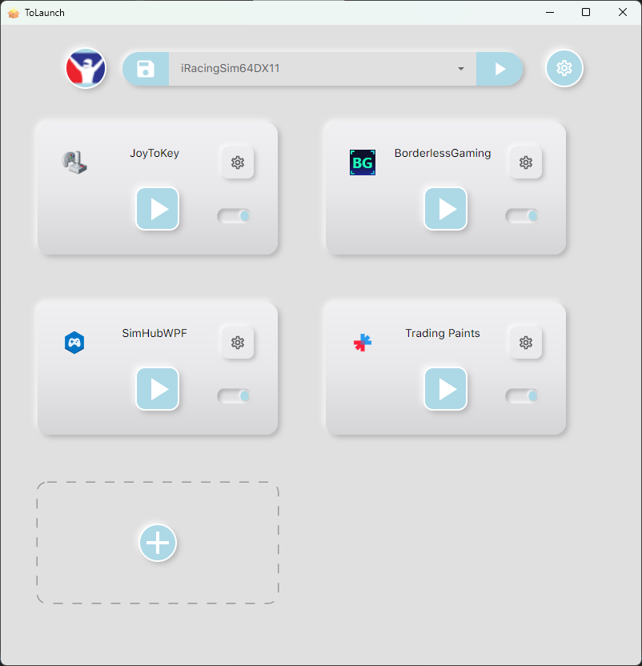
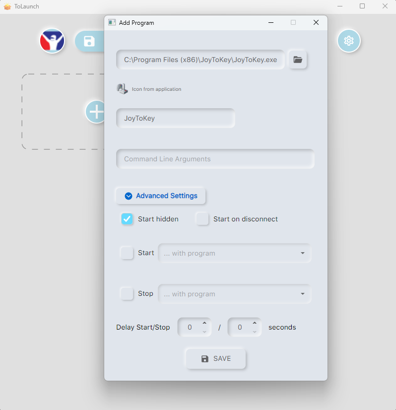
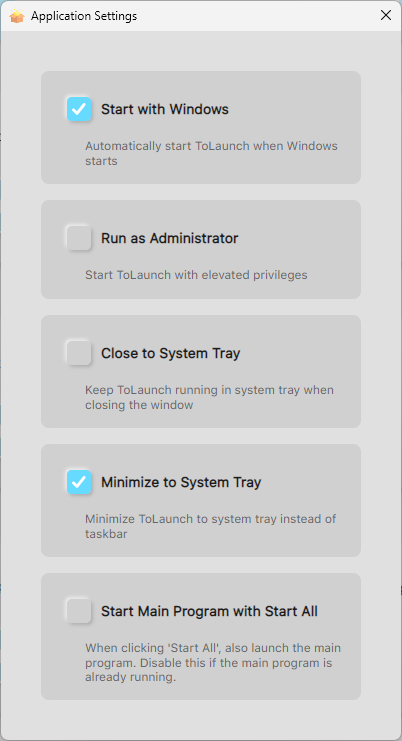

# ToLaunch 🚀

A modern, neumorphic-styled program launcher for Windows that helps you manage and automatically launch multiple programs with your favorite games or applications.
This program is inspired from iRacingManager (which is no longer maintained) that I used to use but enhanced as UI and capability so that it can be used with other applications as well.
## Features ✨

### Profile Management
- **Main Program Selection**: Select your main game/application and ToLaunch will automatically detect when it starts
- **Profile-Based Organization**: Create different profiles for different games or workflows
- **Automatic Icon Extraction**: Main program icons are automatically extracted and displayed
- **Profile Persistence**: All settings are automatically saved per profile

### Automatic Program Launching
- **Process Monitoring**: Automatically detects when your main program starts (checks every 2 seconds)
- **Auto-Start Helper Programs**: When the main program is detected, all enabled helper programs automatically launch
- **Manual Start All**: Manually start all programs with a single click
- **Configurable Delays**: Set individual start/stop delays for each program
- **Hidden Launches**: Option to start programs hidden in the background

### Program Management
- **Enable/Disable Programs**: Toggle programs on/off without removing them from the profile
- **Custom Arguments**: Pass command-line arguments to each program
- **Program Dependencies**: Configure programs to start/stop with other programs
- **Individual Control**: Start/stop individual programs with dedicated buttons

### Modern UI
- **Neumorphic Design**: Beautiful, modern gradient-based card interface
- **Circular Main Program Icon**: Shows your game/app icon in a sleek circular button
- **Dynamic Start/Stop Button**: Changes icon and tooltip based on program state
- **Responsive Cards**: Program cards with gradient backgrounds and intuitive controls

## Screenshots 📸

### Main Window


*Main interface with program cards, profile selection, and control buttons*

### Program Settings


*Configure individual program settings, delays, and dependencies*

### Application Settings


*Global application settings including system tray and startup options*

## Installation 🔧

### Prerequisites
- Windows 10 or later
- .NET 8.0 Runtime or SDK

## Note
The program saves profiles, fetched icons and settings in the user's AppData folder:
```
C:\Users\{UserName}\AppData\Local\ToLaunch
```

